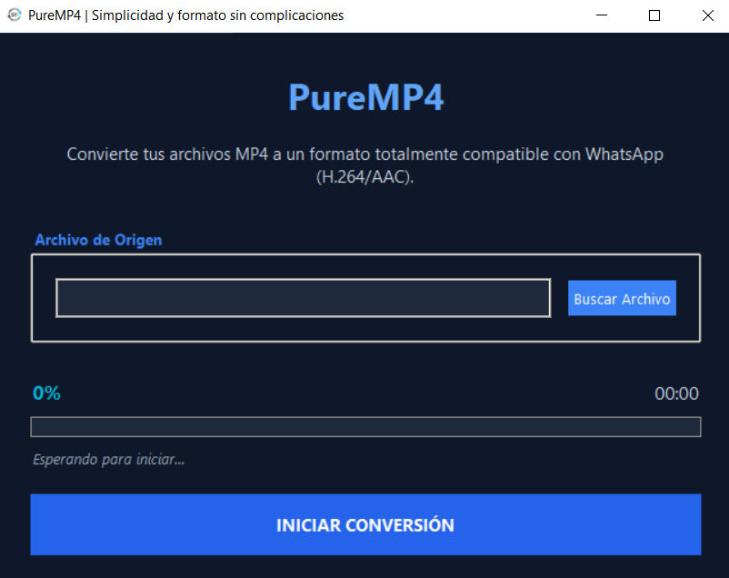

# PureMP4 | Conversor a MP4


PureMP4 es una aplicacion de escritorio que facilita la conversion de diversos formatos de video al estandar MP4, asegurando compatibilidad universal y optimizacion de archivos.

## Vista Previa



## Caracteristicas Principales

- **Conversion Inteligente:** Transforma videos a MP4 (H.264/AAC) de forma automatica.
- **Interfaz Dark Mode:** Diseño moderno y agradable para el usuario.
- **Control de Calidad:** Mantiene la integridad visual del video original.
- **Multi-archivo:** Capacidad para procesar archivos de manera eficiente.

## Requisitos

- Python 3.8 o superior.
- FFmpeg instalado y configurado en el PATH del sistema.

## Instalacion

1. Clona el repositorio o descarga los archivos.
2. Abre una terminal en la carpeta del proyecto.
3. Instala las dependencias:
   ```bash
   pip install -r requirements.txt
   ```

## Uso

1. Ejecuta la aplicacion:
   ```bash
   python main.py
   ```
2. Selecciona el archivo de video de origen.
3. Presiona el boton de convertir.
4. El archivo MP4 se generara en la ubicacion destino.

## Estructura del Proyecto

```text
Convertir mp4/
├── main.py                    # Punto de entrada principal
├── requirements.txt           # Dependencias
├── assets/                    # Iconos y logos
├── src/                       # Codigo fuente
│   ├── gui/                   # Ventanas y widgets
│   ├── logic/                 # Controladores de FFmpeg
│   └── utils/                 # Funciones auxiliares
```

## Tecnologias Utilizadas

- [Python](https://www.python.org/)
- [Tkinter](https://docs.python.org/3/library/tkinter.html) - Interfaz grafica
- [FFmpeg](https://ffmpeg.org/) - Procesamiento multimedia

## Licencia

Este proyecto es de uso libre para propositos educativos y personales.

## Autor

- **Ricardo** - [GitHub](https://github.com/[tu-usuario])
